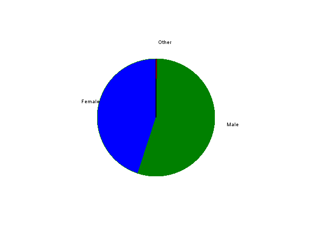
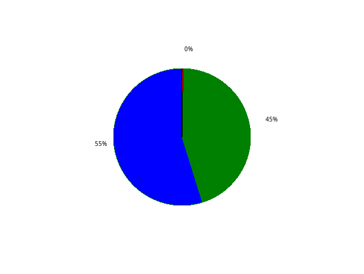
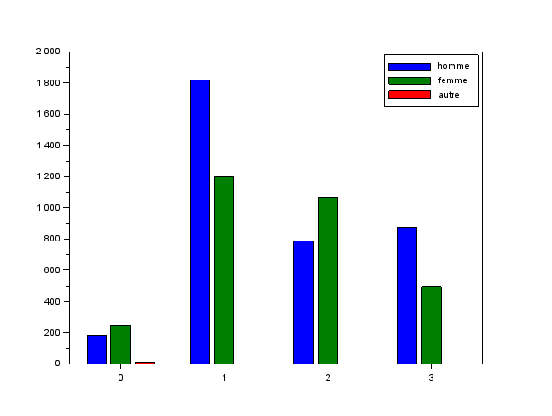
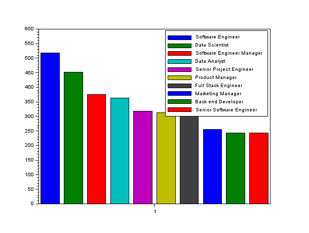

# EXO1

## Table des matières
1. [Répartition des genres](#q1)
2. [Répartition des niveaux d'études suivant le genre](#q2)
3. [Effectifs des 10 professions les plus représentées](#q3)
4. [La profession la plus fréquente](#q4)
5. [Salaire moyen, l'âge moyen et l'expérience moyenne suivant le niveau d'étude](#q5)
6. [Salaire moyen, l'âge moyen et l'expérience moyenne suivant le genre](#q6)

---

## Question 1 {#q1}

> Donnez sous forme de camembert la répartition des genres.

**[Script Scilab](scripts/ex1-1.sce) :**

```scilab
genre = tabul(dataS(:,3),"i")                        
genre(1)                                             
genre(2)                                             
pie(genre(2),genre(1)) 
```

**Résultat :**




---

## Question 2 {#q2}

> Donnez sous forme d'histogramme la répartition des niveaux d'études, suivants le genre.

**[Script Scilab](scripts/ex1-2.sce) :**

```scilab
genre_lvl = [dataS(:,3),dataS(:,4)]                                 

high_homme = length(find(genre_lvl(:,2) == "0" & genre_lvl(:,1) == "Male"))    
high_femme = length(find(genre_lvl(:,2) == "0" & genre_lvl(:,1) == "Female"))   
high_autre = length(find(genre_lvl(:,2) == "0" & genre_lvl(:,1) == "Other"))    

b_homme = length(find(genre_lvl(:,2) == "1" & genre_lvl(:,1) == "Male"))        
b_femme = length(find(genre_lvl(:,2) == "1" & genre_lvl(:,1) == "Female"))      
b_autre = length(find(genre_lvl(:,2) == "1" & genre_lvl(:,1) == "Other"))       

m_homme = length(find(genre_lvl(:,2) == "2" & genre_lvl(:,1) == "Male"))        
m_femme = length(find(genre_lvl(:,2) == "2" & genre_lvl(:,1) == "Female"))      
m_autre = length(find(genre_lvl(:,2) == "2" & genre_lvl(:,1) == "Other"))       

d_homme = length(find(genre_lvl(:,2) == "3" & genre_lvl(:,1) == "Male"))        
d_femme = length(find(genre_lvl(:,2) == "3" & genre_lvl(:,1) == "Female"))      
d_autre = length(find(genre_lvl(:,2) == "3" & genre_lvl(:,1) == "Other"))       

temp = [high_homme, high_femme, high_autre;b_homme, b_femme, b_autre;m_homme, m_femme, m_autre;d_homme, d_femme, d_autre]   // Crée un tableau 
lvlEtude = [0,1,2,3]
bar(lvlEtude,temp)
legend("homme","femme","autre")
```

**Résultat :**



---

## Question 3 {#q3}

> Donnez sous forme d'histogramme, les effectifs des 10 professions les plus représentées.

**[Script Scilab](scripts/ex1-3.sce) :**

```scilab
metiers = tabul(dataS(:,5),"i")                                 
[occu,indice] = gsort(metiers(2))                               
profession = metiers(1)                                         
matrice_occurence = [occu(1:1),occu(2:2),occu(3:3),occu(4:4),occu(5:5),occu(6:6),occu(7:7),occu(8:8),occu(9:9),occu(10:10)]
bar(1,matrice_occurence)                                        
legend(profession(indice(1:10)))                                
```
**Résultat :**



---

## Question 4 {#q4}

> Quelle est la profession la plus fréquente des femmes ? des hommes ?

**[Script Scilab](scripts/ex1-4.sce) :**

```scilab
indice_female = find(dataS(:,3) == "Female")        
[valeurs] = dataS(indice_female,5)                  
metiers_female = tabul(valeurs)                    
[occurence_tri,indice_tri] = gsort(metiers_female(2))   
liste_metiers_female = metiers_female(1)            
liste_metiers_female(119)                           

                                                    

indice_male = find(dataS(:,3) == "Male")            
[valeurs2] = dataS(indice_male,5)                   
metiers_male = tabul(valeurs2)                      
[occurence_tri,indice_tri] = gsort(metiers_male(2)) 
liste_metiers_male = metiers_male(1)                
liste_metiers_male(11)                              

                                                    
```

**Résultat :**

- Homme : Software Engineer

- Femme : Data Scientist


---

## Question 5 {#q4}

> Pour chaque niveau d'études, donnez le salaire moyen, l'âge moyen et l'expérience moyenne.

**[Script Scilab](scripts/ex1-5.sce) :**

```scilab
indice_high = find(dbldata(:,4) == 0)
salaire_high = dbldata(indice_high,7)
mean(salaire_high)                                  
age_high = dbldata(indice_high,2)
mean(age_high)                                      
exp_high = dbldata(indice_high,6)
mean(exp_high)                                      

indice_b = find(dbldata(:,4) == 1)
salaire_b = dbldata(indice_b,7)
mean(salaire_b)                                     
age_b = dbldata(indice_b,2)
mean(age_b)                                         
exp_b = dbldata(indice_b,6)
mean(exp_b)                                         

indice_m = find(dbldata(:,4) == 2)
salaire_m = dbldata(indice_m,7)
mean(salaire_m)                                     
age_m = dbldata(indice_m,2)
mean(age_m)                                         
exp_m = dbldata(indice_m,6)
mean(exp_m)                                         

indice_p = find(dbldata(:,4) == 3)
salaire_p = dbldata(indice_p,7)
mean(salaire_p)                                     
age_p = dbldata(indice_p,2)
mean(age_p)                                         
exp_p = dbldata(indice_p,6)
mean(exp_p)                                         
```

**Résultat :**

// 36706.694
// 26.854911
// 1.9151786

// 95082.909
// 30.260179
// 5.4195631

// 130112.06
// 35.171505
// 9.6456989

// 165651.46
// 41.154858
// 13.915267

---

## Question 6 {#q4}

> Pour chaque genre, donnez le salaire moyen, l'âge moyen et l'expérience moyenne.

**[Script Scilab](scripts/ex1-6.sce) :**

```scilab
pie([surfaceAfrique, surfaceAmeriqueDuNord, surfaceAmeriqueDuSud, surfaceAsie, surfaceEurope, surfaceOceanie])

pie([populationAfrique, populationAmeriqueDuNord, populationAmeriqueDuSud, populationAsie, populationEurope, populationOceanie])
```

**Résultat :**


mean(salaire_6_female)                              // 107889.00

mean(age_6_female)                                  // 32.626286

mean(exp_6_female)                                  // 7.4201792


mean(salaire_6_male)                                // 121389.87

mean(age_6_male)                                    // 34.416394

mean(exp_6_male)                                    // 8.6169662

      
salaire_6_other = dbldata(indice_6_other,7)         // 125869.86
                            
age_6_other = dbldata(indice_6_other,2)             // 39.571429
                                  
exp_6_other = dbldata(indice_6_other,6)             //16.428571


---

[🏠](../ "Retour au sommaire") | [➡️](../EXO2/ "Exercice suivant (Exercice 2)")
