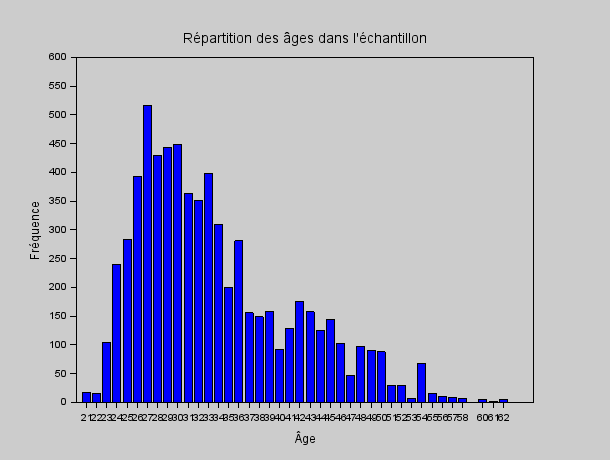
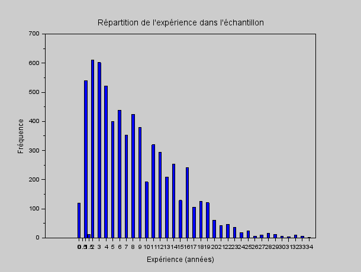
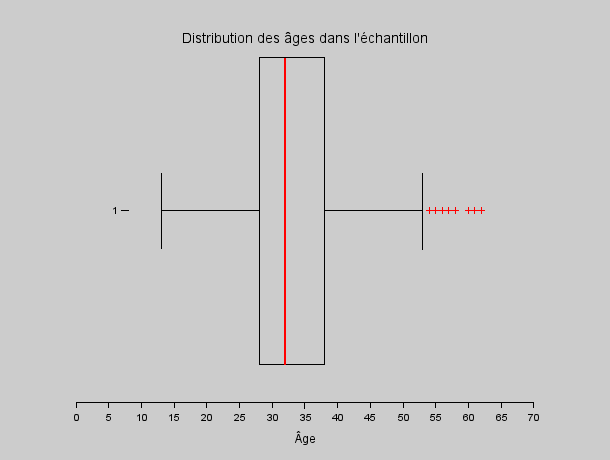
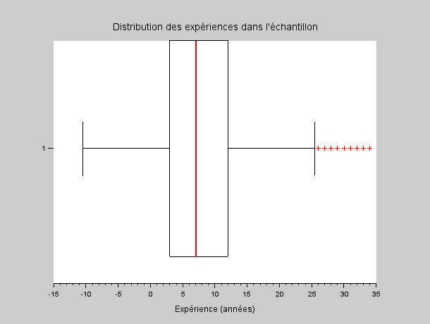

# EXO2

## Table des matières
1. [Distribution des ages](#q1)
2. [Distribution de l'expérience](#q2)
3. [Quartiles, interquatiles, min,max, moyenne, mediane, mode, et ecart type de l'age.](#q3)
4. [Boite à moustache pour l'age](#q4)
5. [Expérience](#q5)

---

## Question 1 {#q1}

> Donnez sous forme d'histogrammes la distribution des ages.

**[Script Scilab](scripts/ex2-1.sce) :**

```scilab
ages = tabul(dbldata(:, 2)); 
figure;                       
bar(ages(:, 1), ages(:, 2));  
xlabel('Âge');
ylabel('Fréquence');
title('Répartition des âges dans l''échantillon'); 
```

**Résultat :**



---

## Question 2 {#q2}

> Donnez sous forme d'histogrammes la distributions de l'expérience.

**[Script Scilab](scripts/ex2-2.sce) :**

```scilab
exp = tabul(dbldata(:, 6));    
figure;                        
bar(exp(:, 1), exp(:, 2));    
xlabel('Expérience (années)');
ylabel('Fréquence');
title('Répartition de l''expérience dans l''échantillon');
```

**Résultat :**



---

## Question 3 {#q3}

> Donnez les quartiles, interquatiles, min,max, moyenne, mediane, mode, et ecart type de l'age.

**[Script Scilab](scripts/ex2-3.sce) :**

```scilab
mean(dbldata(:,2))                                    
min(dbldata(:,2))                                     
max(dbldata(:,2))                                     
median(dbldata(:,2))                                  
quart(dbldata(:,2))                                   
iqr(dbldata(:,2))                                     
stdev(dbldata(:,2))                                                               
```
**Résultat :**

- Moyenne : 33.622033
- Min : 21
- Max : 62

- Médiane : 32
- quartile : 28.32.38.
- Interquartile : 10
- Ecart-type : 7.6156456


---

## Question 4 {#q4}

> A l'aide du paquet stixbox, tracez une boite à moustache pour l'age.

**[Script Scilab](scripts/ex2-4.sce) :**

```scilab
atomsInstall("stixbox")                               //installe le module stixbox
atomsLoad("stixbox")                                  //charge le module stixbox
boxplot(dbldata(:, 2), "orientation", "horizontal"); // Affiche un boxplot des âges
xlabel('Âge');                  // Étiquette de l'axe des x
title('Distribution des âges dans l''échantillon'); // Titre du graphique                                                                             
```

**Résultat :**




---

## Question 5 {#q5}

> Refaire les questions précédentes pour l'expérience.

**[Script Scilab](scripts/ex2-5.sce) :**

```scilab
mean(dbldata(:,6))                                    
min(dbldata(:,6))                                     
max(dbldata(:,6))                                     
median(dbldata(:,6))                                  
quart(dbldata(:,6))                                  
iqr(dbldata(:,6))                                     
stdev(dbldata(:,6))                                   

exp = tabul(dbldata(:,6))                             
[occurence_tri, indice_tri] = gsort(exp(:,2))        
liste_exp = exp(:,1)                                  
mode = liste_exp(indice_tri(1))                       

atomsInstall("stixbox")                               
atomsLoad("stixbox")                                  
boxplot(dbldata(:, 6), "orientation", "horizontal"); 
xlabel('Expérience (années)');  // Étiquette de l'axe des x
title('Distribution des expériences dans l''échantillon');                                    
```

**Résultat :**



---


[⬅️](../EXO1/ "Exercice précédent (Exercice 1)") | [🏠](../ "Retour au sommaire") | [➡️](../EXO3/ "Exercice suivant (Exercice 3)")
