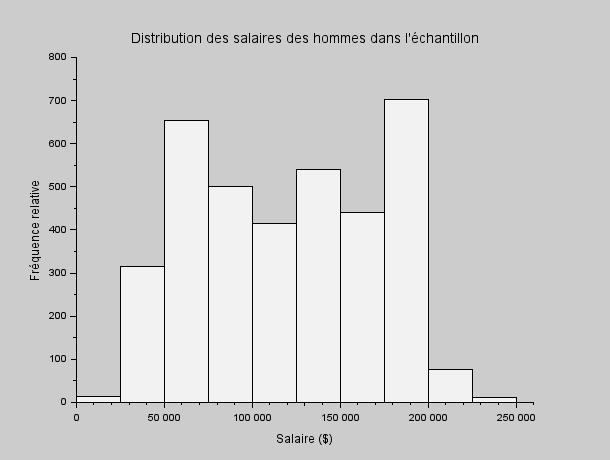
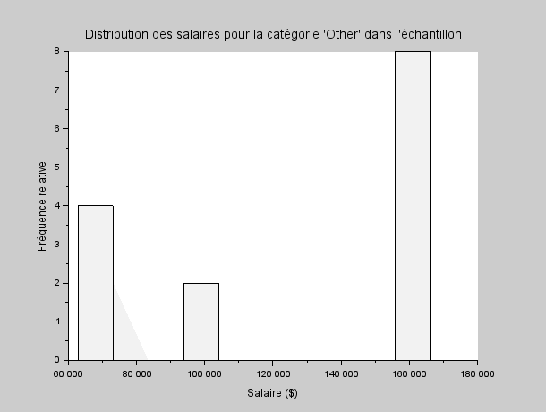
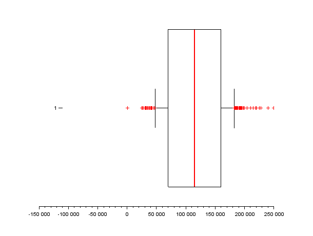

# EXO3

## Table des matières
1. [Distribution des salaires suivant le genre](#q1)
2. [Salaires moyens suivants le niveau d'études](#q2)
3. [Quartiles, interquatiles, min,max, moyenne, mediane, et ecart type des salaires et boite à moustaches](#q3)
4. [Boîte à moustache pour chaque genre](#q4)

---

## Question 1 {#q1}

> Donnez, sous forme d'histogramme la distribution des salaires, suivant le genre.

**[Script Scilab](scripts/ex3-1.sce) :**

```scilab
nbr_classe = 10

id_male = find(dataS(:, 3) == "Male");

salaire_male = dbldata(id_male, 7);

nbr_classe = 10;

histplot(nbr_classe, salaire_male, normalization=%f);  
xlabel('Salaire ($)');             
ylabel('Fréquence relative');       
title('Distribution des salaires des hommes dans l''échantillon');  


id_female = find(dataS(:, 3) == "Female");


salaire_female = dbldata(id_female, 7);


nbr_classe = 10;


histplot(nbr_classe, salaire_female, normalization=%f);  
xlabel('Salaire ($)');              
ylabel('Fréquence relative');       
title('Distribution des salaires des femmes dans l''échantillon');  


id_other = find(dataS(:, 3) == "Other");


salaire_other = dbldata(id_other, 7);

nbr_classe = 10;


histplot(nbr_classe, salaire_other, normalization=%f); 
xlabel('Salaire ($)');              
ylabel('Fréquence relative');       
title('Distribution des salaires pour la catégorie ''Other'' dans l''échantillon');  
```

**Résultat :**






---

## Question 2 {#q2}

> Tracez un histogramme des salaires moyens suivants le niveau d'études.

**[Script Scilab](scripts/ex3-2.sce) :**

```scilab
indice_high = find(dbldata(:,4) == 0)
salaire_high = dbldata(indice_high,7)
moy_h = mean(salaire_high)                                

indice_b = find(dbldata(:,4) == 1)
salaire_b = dbldata(indice_b,7)
moy_b = mean(salaire_b)      

indice_m = find(dbldata(:,4) == 2)
salaire_m = dbldata(indice_m,7)
moy_m = mean(salaire_m)      moy_m = 130112.06     

indice_p = find(dbldata(:,4) == 3)
salaire_p = dbldata(indice_p,7)
moy_p = mean(salaire_p)      moy_p = 165651.46 

                                     

matrice = [moy_h, moy_b, moy_m, moy_p];
bar([0, 1, 2, 3], matrice);

// Ajouter des étiquettes aux axes et un titre
xlabel('Niveau d''études');
ylabel('Salaire moyen ($)');
title('Moyenne des salaires par niveau d''études');
```

**Résultat :**


---

## Question 3 {#q3}

> Donnez les quartiles, interquatiles, min,max, moyenne, mediane, et ecart type des salaires. Tracez une boite à moustaches.

**[Script Scilab](scripts/ex3-3.sce) :**

```scilab
mean(dbldata(:,7))        
min(dbldata(:,7))         
max(dbldata(:,7))         
median(dbldata(:,7))      
quart(dbldata(:,7))       
iqr(dbldata(:,7))         
stdev(dbldata(:,7))       

sal = tabul(dbldata(:,7))
[occurence_tri, indice_tri] = gsort(sal(:,2))
liste_sal = sal(:,1)
mode = liste_sal(indice_tri(1))       

atomsInstall("stixbox")
atomsLoad("stixbox")
boxplot(dbldata(:,7), "orientation", "horizontal");
xlabel('Salaire ($)');
title('Distribution des salaires dans l''échantillon');                                                             
```
**Résultat :**

- Moyenne : 115326.96
- Min : 350
- Max : 250000

- Médiane : 115000
- quartile : [70000.115000.160000]
- Interquartile : 90000
- Ecart-type : 52786.184


---

## Question 4 {#q4}

> Refaire la question précédente, en distingant les genres. Tracez une boîte à moustache pour chaque genre. Commentaires ?

**[Script Scilab](scripts/ex3-4.sce) :**

```scilab
atomsInstall("stixbox")
atomsLoad("stixbox")

id_male = find(dataS(:,3) == "Male")
salaire_male = dbldata(id_male,7)
mean(salaire_male)        
min(salaire_male)         
max(salaire_male)         
median(salaire_male)      
quart(salaire_male)       
iqr(salaire_male)         
stdev(salaire_male)       
sal = tabul(salaire_male)
[occurence_tri, indice_tri] = gsort(sal(:,2))
liste_sal = sal(:,1)
mode = liste_sal(indice_tri(1))        
id_male = find(dataS(:,3) == "Male");
salaire_male = dbldata(id_male, 7);

boxplot(salaire_male, "orientation", "horizontal");
xlabel('Salaire ($)');


id_female = find(dataS(:,3) == "Female")
salaire_female = dbldata(id_female,7)
mean(salaire_female)       
min(salaire_female)         
max(salaire_female)        
median(salaire_female)     
quart(salaire_female)       
iqr(salaire_female)         
stdev(salaire_female)      
sal = tabul(salaire_female)
[occurence_tri, indice_tri] = gsort(sal(:,2))
liste_sal = sal(:,1)
mode = liste_sal(indice_tri(1))        
boxplot(salaire_female', "orientation", "horizontal");


id_other = find(dataS(:,3) == "Other")
salaire_other = dbldata(id_other,7)
mean(salaire_other)        
min(salaire_other)         
max(salaire_other)         
median(salaire_other)      
quart(salaire_other)       
iqr(salaire_other)         
stdev(salaire_other)       
sal = tabul(salaire_other)
[occurence_tri, indice_tri] = gsort(sal(:,2))
liste_sal = sal(:,1)
mode = liste_sal(indice_tri(1))        
boxplot(salaire_other, "orientation", "horizontal")                                                             
```
**Résultat :**
- Homme :
    - Moyenne : 121389.87
    - Min : 350
    - Max : 250000

    - Médiane : 120000
    - quartile : [75000.120000.170000]
    - Interquartile : 95000
    - Ecart-type : 52092.726

    - Mode : 140000

- Femme :
    - Moyenne : 107889.00
    - Min : 500
    - Max : 220000

    - Médiane : 105000
    - quartile : [60000.105000.150000]
    - Interquartile : 90000
    - Ecart-type : 52723.610

    - Mode : 120000

- Autres :
    - Moyenne : 125869.86
    - Min : 62852
    - Max : 166109

    - Médiane : 158610
    - quartile : [69032.158610.161393]
    - Interquartile : 92361
    - Ecart-type : 44242.383

    - Mode : 158966




---


[⬅️](../EXO2/ "Exercice précédent (Exercice 2)") | [🏠](../ "Retour au sommaire") | [➡️](../EXO4/ "Exercice suivant (Exercice 4)")
