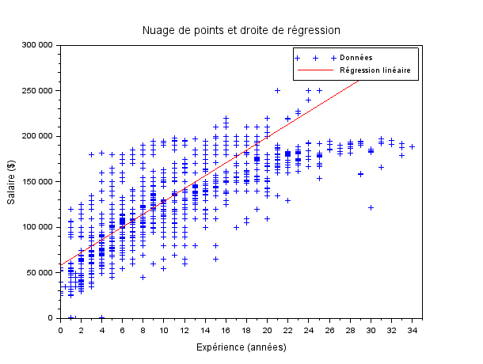

# EXO4

## Table des matières
1. [Nuage de points (age,salaire)](#q1)
2. [Nuage de points (expérience,salaire)](#q2)

---

## Question 1 {#q1}

> Tracez un nuage de points (age,salaire), et la droite de regression correspondante. Quel est le coefficient de corrélation ?

**[Script Scilab](scripts/ex4-1.sce) :**

```scilab
data = csvRead('data.csv');

age = data(:, 2);
salaire = data(:, 7);

clf;

plot2d(age, salaire, -1);
xlabel('Age');
ylabel('Salaire');
title('Nuage de points : Age vs Salaire');

[a, b] = reglin(age', salaire');
y_reg = a * age + b;

plot2d(age, y_reg, 5);


legend(['Données', 'Droite de régression'], 'Location', 'northwest');


mean_age = mean(age);
mean_salaire = mean(salaire);
numerateur = sum((age - mean_age) .* (salaire - mean_salaire));
denominateur = sqrt(sum((age - mean_age).^2) * sum((salaire - mean_salaire).^2));
correlation_coefficient = numerateur / denominateur;


disp(msprintf('Le coefficient de corrélation est : %.6f', correlation_coefficient));      
```

**Résultat :**

- Le coefficient de corrélation est : 0.728053

- Nuage de points :


---

## Question 2 {#q2}

> Tracez un nuage de points (expérience,salaire), et la droite de regression correspondante. Quel est le coefficient de corrélation ?

**[Script Scilab](scripts/ex4-2.sce) :**

```scilab
data = csvRead("data.csv");

experience = data(:, 6);
salaire = data(:, 7);


n = length(experience);
sum_x = sum(experience);
sum_y = sum(salaire);
sum_xy = sum(experience .* salaire);
sum_x2 = sum(experience.^2);

b = (n * sum_xy - sum_x * sum_y) / (n * sum_x2 - sum_x^2);
a = (sum_y - b * sum_x) / n;


clf;


plot(experience, salaire, 'b+');
xlabel('Expérience (années)');
ylabel('Salaire ($)');
title('Nuage de points et droite de régression');


y_pred = a + b * experience;

plot(experience, y_pred, 'r-');


legend(['Données', 'Régression linéaire'], 'location', 'northwest');

mean_experience = mean(experience);
mean_salaire = mean(salaire);

numerator = sum((experience - mean_experience) .* (salaire - mean_salaire));
denominator = sqrt(sum((experience - mean_experience).^2) * sum((salaire - mean_salaire).^2));
correlation = numerator / denominator;


disp(msprintf("Coefficient de corrélation : %.6f", correlation));  
```

**Résultat :**

- Le coefficient de corrélation est : 0.808969

- Nuage de points :



---


[⬅️](../EXO3/ "Exercice précédent (Exercice 3)") | [🏠](../ "Retour au sommaire") | [➡️](../EXO5/ "Exercice suivant (Exercice 5)")