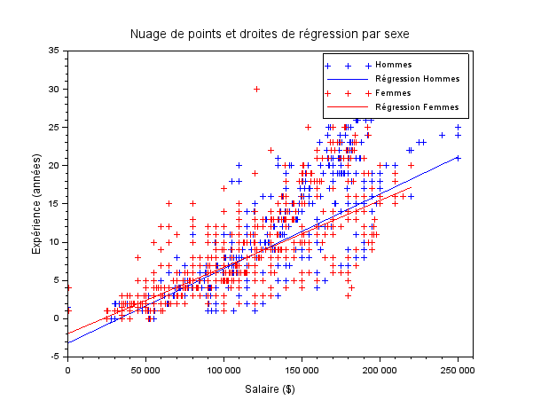
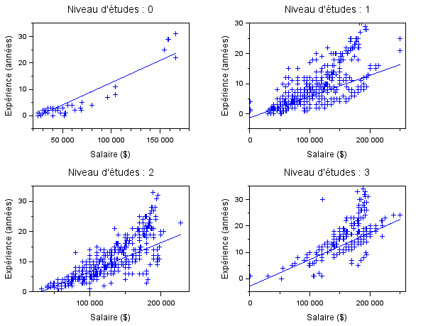

# EXO5

## Table des matières
1. [Nuage de points (salaire, expérience) / droites de regression associées ](#q1)
2. [Nuage de points (salaire, expérience) / droites de regression associées pour chaque niveau d'études](#q2)

---

## Question 1 {#q1}

> Tracez un nuage de points (salaire,expérience) pour les hommes et les femmes, ainsi que les droites de regression associées. Commentaire ?

**[Script Scilab](scripts/ex5-1.sce) :**

```scilab
dbldata = csvRead('data.csv');
dataS = csvRead('data.csv', [], [], 'string');


experience = dbldata(:, 6);
salaire = dbldata(:, 7);
sexe = dataS(:, 3); 


id_male = find(sexe == 'Male');
salaire_male = salaire(id_male);
exp_male = experience(id_male);


X_hommes = [ones(length(salaire_male), 1), salaire_male];
coeffs_hommes = X_hommes \ exp_male;
exp_pred_hommes = X_hommes * coeffs_hommes;

id_female = find(sexe == 'Female');
salaire_female = salaire(id_female);
exp_female = experience(id_female);


X_femmes = [ones(length(salaire_female), 1), salaire_female];
coeffs_femmes = X_femmes \ exp_female;
exp_pred_femmes = X_femmes * coeffs_femmes;

clf;

plot(salaire_male, exp_male, 'b+'); 
plot(salaire_male, exp_pred_hommes, 'b-'); 

plot(salaire_female, exp_female, 'r+');
plot(salaire_female, exp_pred_femmes, 'r-'); 

xlabel('Salaire ($)');
ylabel('Expérience (années)');
title('Nuage de points et droites de régression par sexe');
legend(['Hommes', 'Régression Hommes', 'Femmes', 'Régression Femmes'], 'location', 'northwest');      
```

**Résultat :**



---

## Question 2 {#q2}

> Tracez un nuage de points (salaire,expérience) et les droites de regression associées pour chaque niveau d'études. Commentaire ?

**[Script Scilab](scripts/ex5-2.sce) :**

```scilab

data = csvRead('data.csv');
experience = data(:, 6);
salaire = data(:, 7);
niveau_etudes = data(:, 4); // Assuming column 4 contains education levels


indice_high = find(niveau_etudes == 0);
indice_b = find(niveau_etudes == 1);
indice_m = find(niveau_etudes == 2);
indice_p = find(niveau_etudes == 3);


exp_high = experience(indice_high);
salaire_high = salaire(indice_high);
exp_b = experience(indice_b);
salaire_b = salaire(indice_b);
exp_m = experience(indice_m);
salaire_m = salaire(indice_m);
exp_p = experience(indice_p);
salaire_p = salaire(indice_p);


clf;


subplot(2, 2, 1);
plot(exp_high, salaire_high, '+');
[a, b] = reglin(exp_high', salaire_high');
y_reg = a * exp_high + b;
plot(exp_high, y_reg, '-');
xlabel('Experience (years)');
ylabel('Salary ($)');
title('Niveau d''études : 0');

subplot(2, 2, 2);
plot(exp_b, salaire_b, '+');
[a, b] = reglin(exp_b', salaire_b');
y_reg = a * exp_b + b;
plot(exp_b, y_reg, '-');
xlabel('Experience (years)');
ylabel('Salary ($)');
title('Niveau d''études : 1');

subplot(2, 2, 3);
plot(exp_m, salaire_m, '+');
[a, b] = reglin(exp_m', salaire_m');
y_reg = a * exp_m + b;
plot(exp_m, y_reg, '-');
xlabel('Experience (years)');
ylabel('Salary ($)');
title('Niveau d''études : 2');

subplot(2, 2, 4);
plot(exp_p, salaire_p, '+');
[a, b] = reglin(exp_p', salaire_p');
y_reg = a * exp_p + b;
plot(exp_p, y_reg, '-');
xlabel('Experience (years)');
ylabel('Salary ($)');
title('Niveau d''études : 3'); 
```

**Résultat :**



---


[⬅️](../EXO3/ "Exercice précédent (Exercice 4)") | [🏠](../ "Retour au sommaire")