# SAÉ S2.04 (visualisation de données)

Initialisation :

dbldata = csvRead("data.csv")                         //ouvre data.csv en une matrice d'entier
dataS = csvRead("data.csv",[],[],'string')            //ouvre data.csv en une matrice de string

# EXO1 

// 1.
genre = tabul(dataS(:,3),"i")                        //récupère la liste des genres ainsi que leur occurence MALE=3672,FEMALE=3013,OTHER=14
    genre(1)                                       //liste les différents genres du tableau
    genre(2)                                       //donne l'occurence correspondant aux valeurs de "genre(1)"
pie(genre(2),genre(1))                               //ouvre un diagramme camembert représentant les genres en fonction de leur occurence

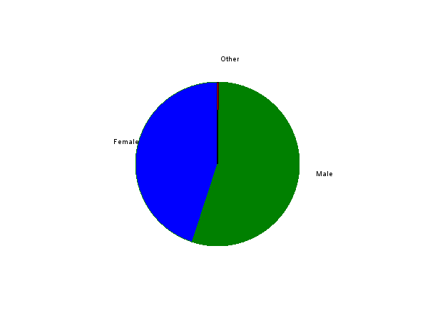

// 2.
genre_lvl = [dataS(:,3),dataS(:,4)]                                      // crée une matrice 6699x2 avec les genres et le niveau d'études

high_homme = length(find(genre_lvl(:,2) == "0" & genre_lvl(:,1) == "Male"))     // renvoie l'occurence d'hommes ayant un niveau d'étude de 0     high_homme =  185.
high_femme = length(find(genre_lvl(:,2) == "0" & genre_lvl(:,1) == "Female"))   // renvoie l'occurence des femmes ayant un niveau d'étude de 0   high_femme =  251.
high_autre = length(find(genre_lvl(:,2) == "0" & genre_lvl(:,1) == "Other"))    // renvoie l'occurence des autres ayant un niveau d'étude de 0   high_autre = 12

b_homme = length(find(genre_lvl(:,2) == "1" & genre_lvl(:,1) == "Male"))        // renvoie l'occurence d'hommes ayant un niveau d'étude de 1      b_homme = 1823.
b_femme = length(find(genre_lvl(:,2) == "1" & genre_lvl(:,1) == "Female"))      // renvoie l'occurence des femmes ayant un niveau d'étude de 1    b_femme = 1198.
b_autre = length(find(genre_lvl(:,2) == "1" & genre_lvl(:,1) == "Other"))       // renvoie l'occurence des autres ayant un niveau d'étude de 1    b_autre = 0.

m_homme = length(find(genre_lvl(:,2) == "2" & genre_lvl(:,1) == "Male"))        // renvoie l'occurence des hommes ayant un niveau d'étude de 2    m_homme = 790.
m_femme = length(find(genre_lvl(:,2) == "2" & genre_lvl(:,1) == "Female"))      // renvoie l'occurence des femmes ayant un niveau d'étude de 2    m_femme = 1068.
m_autre = length(find(genre_lvl(:,2) == "2" & genre_lvl(:,1) == "Other"))       // renvoie l'occurence des autres ayant un niveau d'étude de 2    m_autre = 2.

d_homme = length(find(genre_lvl(:,2) == "3" & genre_lvl(:,1) == "Male"))        // renvoie l'occurence des hommes ayant un niveau d'étude de 3    d_homme = 873.
d_femme = length(find(genre_lvl(:,2) == "3" & genre_lvl(:,1) == "Female"))      // renvoie l'occurence des femmes ayant un niveau d'étude de 3    d_femme = 496.
d_autre = length(find(genre_lvl(:,2) == "3" & genre_lvl(:,1) == "Other"))       // renvoie l'occurence des autres ayant un niveau d'étude de 3    d_autre = 0.

  

temp = [high_homme, high_femme, high_autre;b_homme, b_femme, b_autre;m_homme, m_femme, m_autre;d_homme, d_femme, d_autre]   //crée un tableau 
lvlEtude = [0,1,2,3]
bar(lvlEtude,temp)
legend("homme","femme","autre")

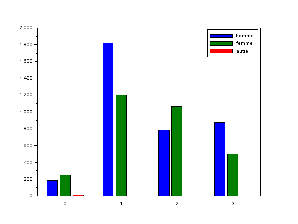

// 3.
metiers = tabul(dataS(:,5),"i")                                 //récupère la liste des profession ainsi que leur occurence
[occu,indice] = gsort(metiers(2))                               //donne la liste des occurence trié ainsi que l'indice que son indice avant le tri
profession = metiers(1)                                         //stock la liste des profession dans une variable
matrice_occurence = [occu(1:1),occu(2:2),occu(3:3),occu(4:4),occu(5:5),occu(6:6),occu(7:7),occu(8:8),occu(9:9),occu(10:10)]
bar(1,matrice_occurence)                                        //affiche l'histogramme des 10 professions avec le plus de monde
legend(profession(indice(1:10)))                                //légende le graphe pour donner un nom à chaque colonne

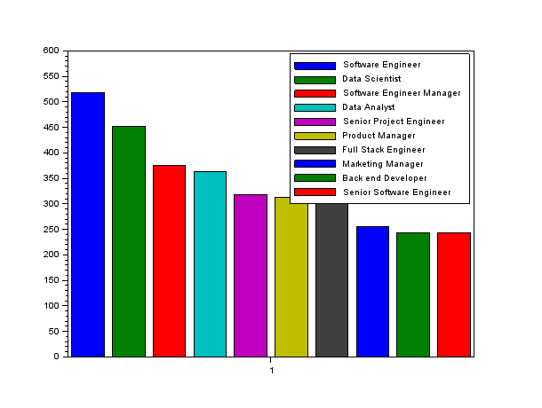

// 4.
indice_female = find(dataS(:,3) == "Female")        //récupère les indice de la colonne 3 de data.csv contenant "Female"
[valeurs] = dataS(indice_female,5)                  //récupère les métiers situés aux indices récupérés précédemment
metiers_female = tabul(valeurs)                     //récupère les métiers sans doublons ainsi que leur occurence
[occurence_tri,indice_tri] = gsort(metiers_female(2))   //récupère et trie dans un tableau ce qu'on a relevé précédemment et relève leur indice d'avant
liste_metiers_female = metiers_female(1)            //récupère dans une variable la liste des métiers unique dans le but de la parcourir par indice
liste_metiers_female(119)                           //relève le métiers recensant le plus de femmes

                                                    // femme = Data Scientist //

indice_male = find(dataS(:,3) == "Male")            //récupère les les indice de la colonne 3 de data.csv contenant "Male"
[valeurs2] = dataS(indice_male,5)                   //récupère les métiers situés aux indices récupérés précédemment
metiers_male = tabul(valeurs2)                      //récupère les métiers sans doublons ainsi que leur occurence
[occurence_tri,indice_tri] = gsort(metiers_male(2)) //récupère et trie dans un tableau ce qu'on a relevé précédemment et relève leur indice d'avant
liste_metiers_male = metiers_male(1)                //récupère dans une variable la liste des métiers unique dans le but de la parcourir par indice
liste_metiers_male(11)                              //relève le métiers recensant le plus d'hommes

                                                    // homme = Software Engineer //

// 5.
indice_high = find(dbldata(:,4) == 0)
salaire_high = dbldata(indice_high,7)
mean(salaire_high)                                  // 36706.694
age_high = dbldata(indice_high,2)
mean(age_high)                                      // 26.854911
exp_high = dbldata(indice_high,6)
mean(exp_high)                                      // 1.9151786

indice_b = find(dbldata(:,4) == 1)
salaire_b = dbldata(indice_b,7)
mean(salaire_b)                                     // 95082.909
age_b = dbldata(indice_b,2)
mean(age_b)                                         // 30.260179
exp_b = dbldata(indice_b,6)
mean(exp_b)                                         // 5.4195631

indice_m = find(dbldata(:,4) == 2)
salaire_m = dbldata(indice_m,7)
mean(salaire_m)                                     // 130112.06
age_m = dbldata(indice_m,2)
mean(age_m)                                         // 35.171505
exp_m = dbldata(indice_m,6)
mean(exp_m)                                         // 9.6456989

indice_p = find(dbldata(:,4) == 3)
salaire_p = dbldata(indice_p,7)
mean(salaire_p)                                     // 165651.46
age_p = dbldata(indice_p,2)
mean(age_p)                                         // 41.154858
exp_p = dbldata(indice_p,6)
mean(exp_p)                                         // 13.915267

// 6.
indice_6_female = find(dataS(:,3) == "Female")
salaire_6_female = dbldata(indice_6_female,7)
mean(salaire_6_female)                              // 107889.00
age_6_female = dbldata(indice_6_female,2)
mean(age_6_female)                                  // 32.626286
exp_6_female = dbldata(indice_6_female,6)
mean(exp_6_female)                                  // 7.4201792

indice_6_male = find(dataS(:,3) == "Male")
salaire_6_male = dbldata(indice_6_male,7)
mean(salaire_6_male)                                // 121389.87
age_6_male = dbldata(indice_6_male,2)
mean(age_6_male)                                    // 34.416394
exp_6_male = dbldata(indice_6_male,6)
mean(exp_6_male)                                    // 8.6169662

indice_6_other = find(dataS(:,3) == "Other")        
salaire_6_other = dbldata(indice_6_other,7)         // 125869.86
mean(salaire_6_other)                              
age_6_other = dbldata(indice_6_other,2)             // 39.571429
mean(age_6_other)                                   
exp_6_other = dbldata(indice_6_other,6)             //16.428571
mean(exp_6_other)                                  
					                                

# EXO2 

// 1.
ages = tabul(dbldata(:, 2)); // Récupère la liste des âges et leurs occurrences
figure;                       // Nouvelle figure
bar(ages(:, 1), ages(:, 2));  // Affiche un histogramme des âges
xlabel('Âge');
ylabel('Fréquence');
title('Répartition des âges dans l''échantillon');

// 2.
exp = tabul(dbldata(:, 6));    // Récupère la liste des expériences et leurs occurrences
figure;                        // Nouvelle figure
bar(exp(:, 1), exp(:, 2));     // Affiche un histogramme des expériences
xlabel('Expérience (années)');
ylabel('Fréquence');
title('Répartition de l''expérience dans l''échantillon');

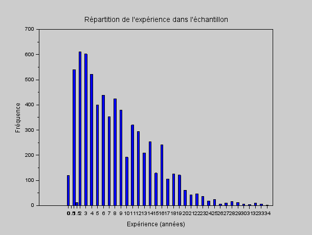

// 3.
mean(dbldata(:,2))                                    //moyenne  =  33.622033
min(dbldata(:,2))                                     //min      =  21
max(dbldata(:,2))                                     //max      =  62
median(dbldata(:,2))                                  //médianne  =  32
quart(dbldata(:,2))                                   //quartile  = 28.32.38.
iqr(dbldata(:,2))                                     //interquartile = 10
stdev(dbldata(:,2))                                   //ecart-type = 7.6156456

age = tabul(dbldata(:,2))                             //récupère la liste des âges et leurs occurrences
[occurence_tri, indice_tri] = gsort(age(:,2))         //trie les occurrences et récupère les indices
liste_age = age(:,1)                                  //liste des âges
mode = liste_age(indice_tri(1))                       //mode =27  

// 4.
atomsInstall("stixbox")                               //installe le module stixbox
atomsLoad("stixbox")                                  //charge le module stixbox
boxplot(dbldata(:, 2), "orientation", "horizontal"); // Affiche un boxplot des âges
xlabel('Âge');                  // Étiquette de l'axe des x
title('Distribution des âges dans l''échantillon'); // Titre du graphique

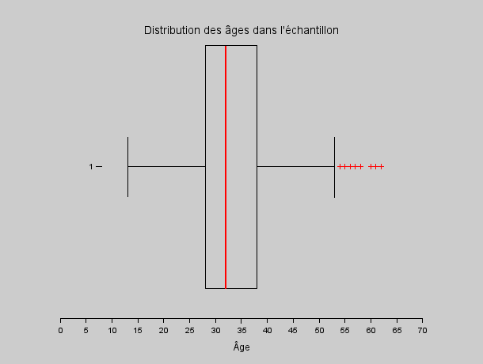

// 5. 

mean(dbldata(:,6))                                    //moyenne  =  8.0950142
min(dbldata(:,6))                                     //min  =  0
max(dbldata(:,6))                                     //max  =   34
median(dbldata(:,6))                                  //médianne = 7
quart(dbldata(:,6))                                   //quartile  = [3.7.12]
iqr(dbldata(:,6))                                     //interquartile = 9
stdev(dbldata(:,6))                                   //ecart-type =  6.0598534

exp = tabul(dbldata(:,6))                             //récupère la liste des expériences et leurs occurrences
[occurence_tri, indice_tri] = gsort(exp(:,2))         //trie les occurrences et récupère les indices
liste_exp = exp(:,1)                                  //liste des expériences
mode = liste_exp(indice_tri(1))                       //mode = 2

atomsInstall("stixbox")                               //installe le module stixbox
atomsLoad("stixbox")                                  //charge le module stixbox
boxplot(dbldata(:, 6), "orientation", "horizontal"); // Affiche un boxplot des expériences
xlabel('Expérience (années)');  // Étiquette de l'axe des x
title('Distribution des expériences dans l''échantillon'); // Titre du graphique

# EXO3
// 1.
nbr_classe = 10

// Identifier les indices des hommes
id_male = find(dataS(:, 3) == "Male");

// Extraire les salaires des hommes
salaire_male = dbldata(id_male, 7);

// Définir le nombre de classes pour l'histogramme
nbr_classe = 10;

// Afficher un histogramme des salaires des hommes
histplot(nbr_classe, salaire_male, normalization=%f);  // Histogramme des salaires des hommes
xlabel('Salaire ($)');              // Étiquette de l'axe des x
ylabel('Fréquence relative');       // Étiquette de l'axe des y
title('Distribution des salaires des hommes dans l''échantillon');  // Titre du graphique

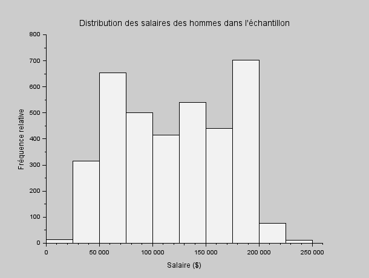

// Identifier les indices des femmes
id_female = find(dataS(:, 3) == "Female");

// Extraire les salaires des femmes
salaire_female = dbldata(id_female, 7);

// Définir le nombre de classes pour l'histogramme
nbr_classe = 10;

// Afficher un histogramme des salaires des femmes
histplot(nbr_classe, salaire_female, normalization=%f);  // Histogramme des salaires des femmes
xlabel('Salaire ($)');              // Étiquette de l'axe des x
ylabel('Fréquence relative');       // Étiquette de l'axe des y
title('Distribution des salaires des femmes dans l''échantillon');  // Titre du graphique

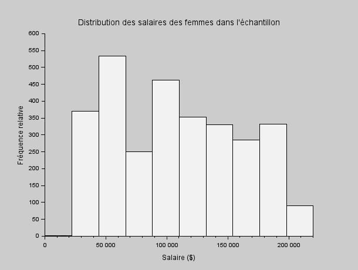

// Identifier les indices pour la catégorie "Other"
id_other = find(dataS(:, 3) == "Other");

// Extraire les salaires pour la catégorie "Other"
salaire_other = dbldata(id_other, 7);

// Définir le nombre de classes pour l'histogramme
nbr_classe = 10;

// Afficher un histogramme des salaires pour la catégorie "Other"
histplot(nbr_classe, salaire_other, normalization=%f);  // Histogramme des salaires pour la catégorie "Other"
xlabel('Salaire ($)');              // Étiquette de l'axe des x
ylabel('Fréquence relative');       // Étiquette de l'axe des y
title('Distribution des salaires pour la catégorie ''Other'' dans l''échantillon');  // Titre du graphique

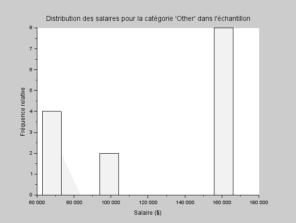

// 2.
indice_high = find(dbldata(:,4) == 0)
salaire_high = dbldata(indice_high,7)
moy_h = mean(salaire_high)   // moy_h = 36706.694                                     

indice_b = find(dbldata(:,4) == 1)
salaire_b = dbldata(indice_b,7)
moy_b = mean(salaire_b)      // moy_b = 95082.909 

indice_m = find(dbldata(:,4) == 2)
salaire_m = dbldata(indice_m,7)
moy_m = mean(salaire_m)      moy_m = 130112.06     

indice_p = find(dbldata(:,4) == 3)
salaire_p = dbldata(indice_p,7)
moy_p = mean(salaire_p)      moy_p = 165651.46 

                                     

matrice = [moy_h, moy_b, moy_m, moy_p];
bar([0, 1, 2, 3], matrice);

// Ajouter des étiquettes aux axes et un titre
xlabel('Niveau d''études');
ylabel('Salaire moyen ($)');
title('Moyenne des salaires par niveau d''études');

// 3.
mean(dbldata(:,7))        // moyenne = 115326.96
min(dbldata(:,7))         // min = 350
max(dbldata(:,7))         // max = 250000
median(dbldata(:,7))      // médianne = 115000
quart(dbldata(:,7))       // quartile = [70000.115000.160000]
iqr(dbldata(:,7))         // interquartile = 90000
stdev(dbldata(:,7))       // écart-type = 52786.184

sal = tabul(dbldata(:,7))
[occurence_tri, indice_tri] = gsort(sal(:,2))
liste_sal = sal(:,1)
mode = liste_sal(indice_tri(1))        // mode = 140000

atomsInstall("stixbox")
atomsLoad("stixbox")
boxplot(dbldata(:,7), "orientation", "horizontal");
xlabel('Salaire ($)');
title('Distribution des salaires dans l''échantillon');

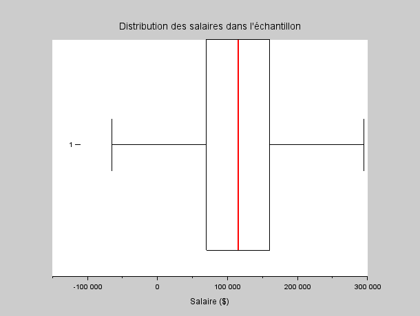

// 4.
atomsInstall("stixbox")
atomsLoad("stixbox")

id_male = find(dataS(:,3) == "Male")
salaire_male = dbldata(id_male,7)
mean(salaire_male)        // moyenne = 121389.87
min(salaire_male)         // min = 350
max(salaire_male)         // max = 250000
median(salaire_male)      // médianne = 120000
quart(salaire_male)       // quartile = [75000.120000.170000]
iqr(salaire_male)         // interquartile = 95000
stdev(salaire_male)       // écart-type = 52092.726
sal = tabul(salaire_male)
[occurence_tri, indice_tri] = gsort(sal(:,2))
liste_sal = sal(:,1)
mode = liste_sal(indice_tri(1))        // mode = 140000
id_male = find(dataS(:,3) == "Male");
salaire_male = dbldata(id_male, 7);

boxplot(salaire_male, "orientation", "horizontal");
xlabel('Salaire ($)');

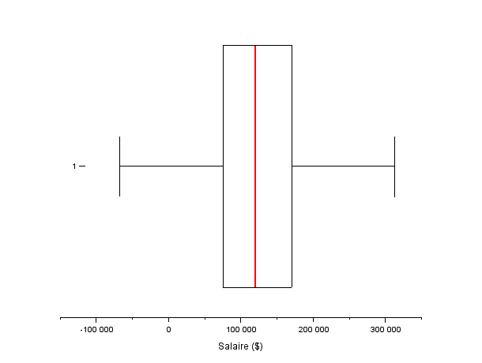

id_female = find(dataS(:,3) == "Female")
salaire_female = dbldata(id_female,7)
mean(salaire_female)        // moyenne = 107889.00
min(salaire_female)         // min = 500.
max(salaire_female)         // max = 220000
median(salaire_female)      // médianne = 105000
quart(salaire_female)       // quartile = [60000.105000.150000]
iqr(salaire_female)         // interquartile = 90000
stdev(salaire_female)       // écart-type = 52723.610
sal = tabul(salaire_female)
[occurence_tri, indice_tri] = gsort(sal(:,2))
liste_sal = sal(:,1)
mode = liste_sal(indice_tri(1))        // mode = 120000
boxplot(salaire_female', "orientation", "horizontal");

id_other = find(dataS(:,3) == "Other")
salaire_other = dbldata(id_other,7)
mean(salaire_other)        // moyenne =  125869.86
min(salaire_other)         // min = 62852.
max(salaire_other)         // max = 166109
median(salaire_other)      // médianne = 158610
quart(salaire_other)       // quartile = [69032.158610.161393]
iqr(salaire_other)         // interquartile = 92361
stdev(salaire_other)       // écart-type = 44242.383
sal = tabul(salaire_other)
[occurence_tri, indice_tri] = gsort(sal(:,2))
liste_sal = sal(:,1)
mode = liste_sal(indice_tri(1))        // mode = 158966
boxplot(salaire_other, "orientation", "horizontal")
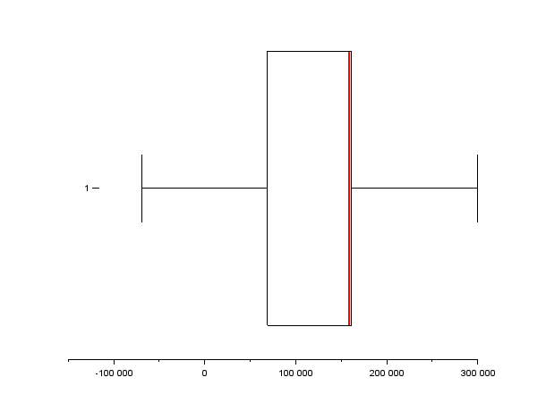

# ExO4 
1. Tracez un nuage de points (age,salaire), et la droite de regression correspondante. Quel est le coefficient de corrélation ?
// Lire les données
data = csvRead('data.csv');

// Extraire les colonnes pertinentes (âge et salaire)
age = data(:, 2);
salaire = data(:, 7);

// Effacer la figure
clf;

// Tracer le nuage de points
plot2d(age, salaire, -1);
xlabel('Age');
ylabel('Salaire');
title('Nuage de points : Age vs Salaire');

// Calculer les coefficients de la droite de régression
[a, b] = reglin(age', salaire');
y_reg = a * age + b;

// Tracer la droite de régression
plot2d(age, y_reg, 5);

// Ajouter une légende
legend(['Données', 'Droite de régression'], 'Location', 'northwest');

// Calcul manuel du coefficient de corrélation
mean_age = mean(age);
mean_salaire = mean(salaire);
numerateur = sum((age - mean_age) .* (salaire - mean_salaire));
denominateur = sqrt(sum((age - mean_age).^2) * sum((salaire - mean_salaire).^2));
correlation_coefficient = numerateur / denominateur;

// Afficher le coefficient de corrélation
disp(msprintf('Le coefficient de corrélation est : %.6f', correlation_coefficient));      //"Le coefficient de corrélation est : 0.728053"

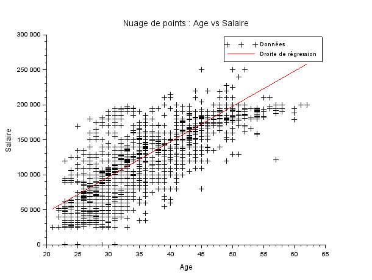

2. Tracez un nuage de points (expérience,salaire), et la droite de regression correspondante. Quel est le coefficient de corrélation ?

// Lire les données
data = csvRead("data.csv");

// Extraire les colonnes pertinentes (expérience et salaire)
experience = data(:, 6);
salaire = data(:, 7);

// Calcul des coefficients de la droite de régression
n = length(experience);
sum_x = sum(experience);
sum_y = sum(salaire);
sum_xy = sum(experience .* salaire);
sum_x2 = sum(experience.^2);

b = (n * sum_xy - sum_x * sum_y) / (n * sum_x2 - sum_x^2);
a = (sum_y - b * sum_x) / n;

// Effacer la figure
clf;

// Tracer le nuage de points
plot(experience, salaire, 'b+');
xlabel('Expérience (années)');
ylabel('Salaire ($)');
title('Nuage de points et droite de régression');

// Calculer les valeurs prédites par la droite de régression
y_pred = a + b * experience;

// Tracer la droite de régression
plot(experience, y_pred, 'r-');

// Ajouter une légende
legend(['Données', 'Régression linéaire'], 'location', 'northwest');

// Calcul manuel du coefficient de corrélation
mean_experience = mean(experience);
mean_salaire = mean(salaire);

numerator = sum((experience - mean_experience) .* (salaire - mean_salaire));
denominator = sqrt(sum((experience - mean_experience).^2) * sum((salaire - mean_salaire).^2));
correlation = numerator / denominator;

// Afficher le coefficient de corrélation
disp(msprintf("Coefficient de corrélation : %.6f", correlation));   //"Coefficient de corrélation : 0.808969"

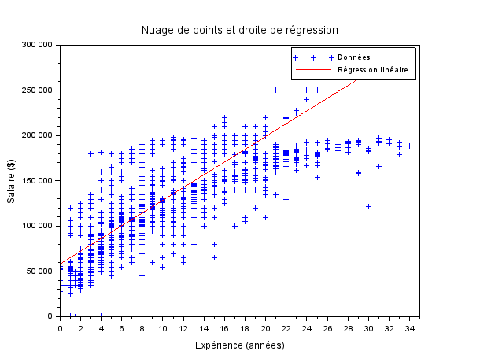

# ExO5 
1. Tracez un nuage de points (salaire,expérience) pour les hommes et les femmes, ainsi que les droites de regression associées. Commentaire ?

// Charger les données
dbldata = csvRead('data.csv');
dataS = csvRead('data.csv', [], [], 'string');

// Extraire les colonnes pertinentes (expérience, salaire, sexe)
experience = dbldata(:, 6);
salaire = dbldata(:, 7);
sexe = dataS(:, 3); 

// Séparer les données pour les hommes
id_male = find(sexe == 'Male');
salaire_male = salaire(id_male);
exp_male = experience(id_male);

// Calcul de la régression linéaire pour les hommes (méthode des moindres carrés)
X_hommes = [ones(length(salaire_male), 1), salaire_male];
coeffs_hommes = X_hommes \ exp_male;
exp_pred_hommes = X_hommes * coeffs_hommes;

// Séparer les données pour les femmes
id_female = find(sexe == 'Female');
salaire_female = salaire(id_female);
exp_female = experience(id_female);

// Calcul de la régression linéaire pour les femmes (méthode des moindres carrés)
X_femmes = [ones(length(salaire_female), 1), salaire_female];
coeffs_femmes = X_femmes \ exp_female;
exp_pred_femmes = X_femmes * coeffs_femmes;

// Tracer le nuage de points et les droites de régression
clf;

plot(salaire_male, exp_male, 'b+'); // Nuage de points pour les hommes
plot(salaire_male, exp_pred_hommes, 'b-'); // Droite de régression pour les hommes

plot(salaire_female, exp_female, 'r+'); // Nuage de points pour les femmes
plot(salaire_female, exp_pred_femmes, 'r-'); // Droite de régression pour les femmes

xlabel('Salaire ($)');
ylabel('Expérience (années)');
title('Nuage de points et droites de régression par sexe');
legend(['Hommes', 'Régression Hommes', 'Femmes', 'Régression Femmes'], 'location', 'northwest');

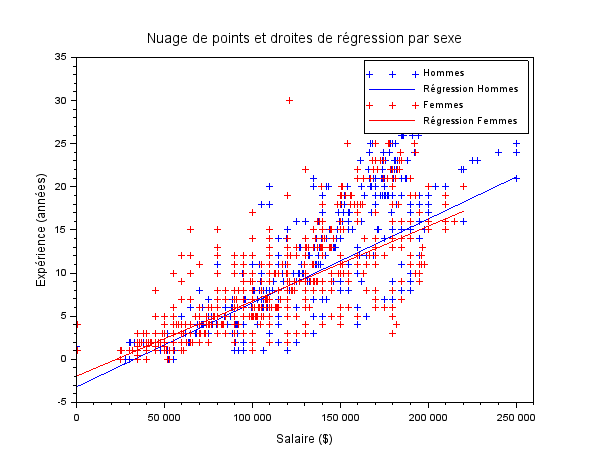

2. Tracez un nuage de points (salaire,expérince) et les droites de regression associées pour chaque niveau d'études. Commentaire ?

// Load data
data = csvRead('data.csv');
experience = data(:, 6);
salaire = data(:, 7);
niveau_etudes = data(:, 4); // Assuming column 4 contains education levels

// Indices for each education level
indice_high = find(niveau_etudes == 0);
indice_b = find(niveau_etudes == 1);
indice_m = find(niveau_etudes == 2);
indice_p = find(niveau_etudes == 3);

// Extract data for each education level
exp_high = experience(indice_high);
salaire_high = salaire(indice_high);
exp_b = experience(indice_b);
salaire_b = salaire(indice_b);
exp_m = experience(indice_m);
salaire_m = salaire(indice_m);
exp_p = experience(indice_p);
salaire_p = salaire(indice_p);

// Clear current figure
clf;

// Plot for education level 0
subplot(2, 2, 1);
plot(exp_high, salaire_high, '+');
[a, b] = reglin(exp_high', salaire_high');
y_reg = a * exp_high + b;
plot(exp_high, y_reg, '-');
xlabel('Experience (years)');
ylabel('Salary ($)');
title('Niveau d''études : 0');

// Plot for education level 1
subplot(2, 2, 2);
plot(exp_b, salaire_b, '+');
[a, b] = reglin(exp_b', salaire_b');
y_reg = a * exp_b + b;
plot(exp_b, y_reg, '-');
xlabel('Experience (years)');
ylabel('Salary ($)');
title('Niveau d''études : 1');

// Plot for education level 2
subplot(2, 2, 3);
plot(exp_m, salaire_m, '+');
[a, b] = reglin(exp_m', salaire_m');
y_reg = a * exp_m + b;
plot(exp_m, y_reg, '-');
xlabel('Experience (years)');
ylabel('Salary ($)');
title('Niveau d''études : 2');

// Plot for education level 3
subplot(2, 2, 4);
plot(exp_p, salaire_p, '+');
[a, b] = reglin(exp_p', salaire_p');
y_reg = a * exp_p + b;
plot(exp_p, y_reg, '-');
xlabel('Experience (years)');
ylabel('Salary ($)');
title('Niveau d''études : 3');

